# TCP

# 1、报文格式

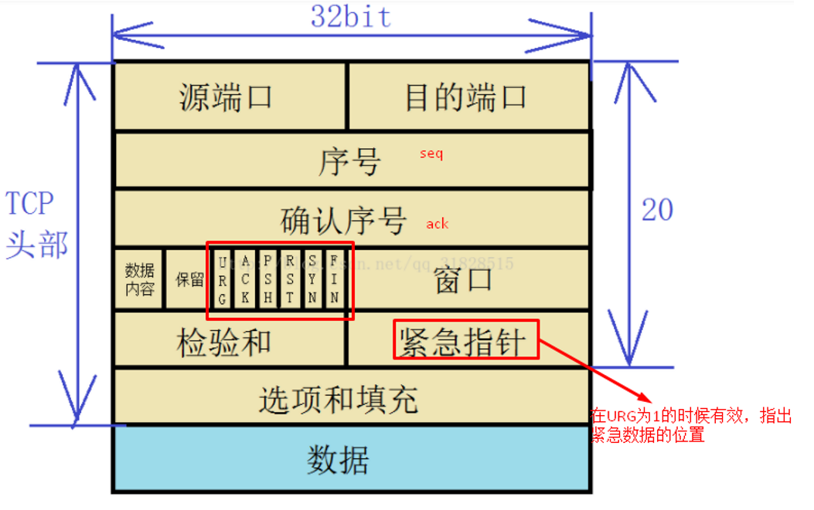

- 源端口和目的端口

各自占用两个字节，用来表示主机中的通信进程。端口号和IP组合即为套接字

 

- 序号

也叫发送序号，TCP将发送的每一个数据流都进行了编号，整个数据的起始序号在开始连接的时候设置

 

- 确认序号

指接受主机期望收到的下一个报文序号是多少

 

- 数据内容

又称为首部长度，标明TCP首部数据包的长度，单位是四个字节

 

- 六个控制字符

（1）URG (Urgent)

紧急指针有效位

 

（2）ACK

确认连接，1为有效

 

（3）PSH (PUSH)

要求对方数据尽快达到应用层 （不用等缓冲区满，直接传到应用层）

 

（4）RST

连接出现问题，需要重新建立连接

 

（5）SYN

进行连接的建立

 

（6）FIN

断开连接，提出断开连接的一方的FIN为1

- 窗口

告诉对方自己的窗口大小，用于流量控制

 

- 检验和

检验报文内容的正确性

 

- 紧急指针

当URG有效时，紧急指针便有效。紧急指针用来在紧急情况下进行数据的传输

 

- 选项和填充

可有可无，对数据的额外控制

 

## 1.2 URG的详细介绍

紧急指针指出了紧急数据的末尾在报文段中的位置。

 

当所有紧急数据都处理完毕后，TCP就告诉应用程序恢复到正常的操作。

 

注意：即使窗口为0时，也可以发送紧急数据 。

URG=1告诉系统此报文段中有紧急数据，应当尽快传送（相当于高优先级的数据），而不是按照原先的顺序来传送。

### URG运用实例

我们现在在运行一个程序，改程序需要运行很长的时间，但是突然发现程序里面有一个错误，需要及时的去进行修改，所以我们通过键入Ctrl-C给系统发送一个终止信号。

如果我们不使用紧急数据的话，这两个字符将存储在接受TCP的缓存的末尾，只有在所有数据处理完毕之后我们才能将这两个字符交付给接收方的应用程序，这样似乎就失去了提前终止的意义了。

所以，我们通过及时的设置URG=1，告诉发送方此时有紧急数据需要传输，于是发送方TCP就将紧急数据插入到本段报文数据段的最前方，这些数据就叫做“带外数据”，而在紧急数据后面的就是正常的普通数据了。

特性:

（1）紧急数据的起始点 = 序号

（2）紧急数据的终止点 = 序号+紧急指针

（3）紧急指针就是记录紧急数据的字节数，紧急指针永远为正数

（4）在紧急数据后面的数据为普通数据，需要按序缓存

（5）可以在窗口为0时发送紧急数据

（6）紧急数据都处理完成后，tcp就告诉进程恢复到正常操作

（7）URG强调的是直接读取数据,不会将该数据复制到缓存中

## 1.3 PSH的详细介绍

推送PSH，PSH叫做急迫位。

 

当两个应用程序进行交互式的通信时，有时在一端的应用进程希望在键入一个命令后立即就能够收到对方的响应。

 

在这种情况下，TCP就可以使用推送（push）操作。

 

这时，发送方TCP把PSH置1，并立即创建一个报文段发送出去。

 

接受方TCP收到PSH=1的报文，就尽快地（即“推送”向前）交付接受应用程序，而不再等到整个缓存都填满了后在向上交付。

 

（注：虽然应用程序可以选择推送操作，但是推送操作还很少使用）

 

### PSH的使用实例

在一个交互程序中，当客户发送一个命令给服务器时，它设置PUSH标志并停下来等待服务器的响应。

 

通过允许客户应用程序通知其TCP设置PUSH标志，客户进程通知TCP在向服务器发送一个报文段时不要因等待额外数据而使已提交数据在缓存中滞留。

 

类似地，当服务器的TCP接收到一个设置了PUSH标志的报文段时，它需要立即将这些数据（包括以前存中滞留的数据）递交给服务器进程而不能等待判断是否还会有额外的数据到达。

 

PSH=1，只对接收方的接收缓冲区起作用，发送方通过使用PUSH位来通知接收方将所有收到的数据立即提交给服务器进程，而不需要等待额外数据(将缓存填满)而让数据在缓存中停留！

 

这里所说的数据包括与此PUSH包一起传输的数据以及之前就为该进程传输过来的数据（滞留在缓存中的数据）。

特性

（1）PSH=1表示该报文希望在到达对端时，将这个报文及缓存区之间缓存尚未交付的数据一并交付给进程。

（2）PSH的数据=本报文数据+缓存区数

（3）PSH的方向--->单方向（接收PSH报文的一端）

（4）PSH强调的是尽快将数据交付给上层(协议),而不需要经过强迫数据交互(默认tcp/ip是将数据缓存到一定的上限,再将数据递交给上层,以提高网络性能).可见,该部分数据是需要复制到缓存中的

 

 

**总结**

- 相同点

他们都是对数据的一种处理方式，URG和PSH都用于紧急情况的处理

- 不同点

（1）发送方式不同。URG是前端，PSH是后端。

（2）URG置为1时，对于发送方，“带外数据”与正常情况下应该发送的消息数据一起，封装成数据报发送，省去了在队列中等待的时间。 

（3）在接收方，解析报文后，获取数据之后还是要放在缓存区中，等待满了之后在向上往应用层交付。

PSH置为1时，对于发送方，表明这些数据不需要等向下发送的缓存区满，立刻封装成报文，发送，省去了等待发送缓存区到达满的状态的时间。

（4）在接收方，也不需要等接受缓存区满，直接向上交付给应用层

## 1.4 RST

RST：（Reset the connection）**用于复位因某种原因引起出现的错误连接，也用来拒绝非法数据和请求**。如果接收到RST位时候，通常发生了某些错误；

发送RST包关闭连接时，不必等缓冲区的包都发出去，直接就丢弃缓冲区中的包，发送RST；接收端收到RST包后，也不必发送ACK包来确认。

“Connection reset”的原因是服务器关闭了Connection[调用了Socket.close()方法]。大家可能有疑问了：服务器关闭了Connection为什么会返回“RST”而不是返回“FIN”标志。原因在于Socket.close()方法的语义和TCP的“FIN”标志语义不一样：发送TCP的“FIN”标志表示我不再发送数据了，而Socket.close()表示我不在发送也不接受数据了。问题就出在“我不接受数据” 上，如果此时客户端还往服务器发送数据，服务器内核接收到数据，但是发现此时Socket已经close了，则会返回“RST”标志给客户端。当然，此时客户端就会提示：“Connection reset”。

# 2、三次握手

ack其实是回应seq告诉对面下一个数据包的序号是多少。

开始的seq是随机的数，用来记录第一个包的序号。

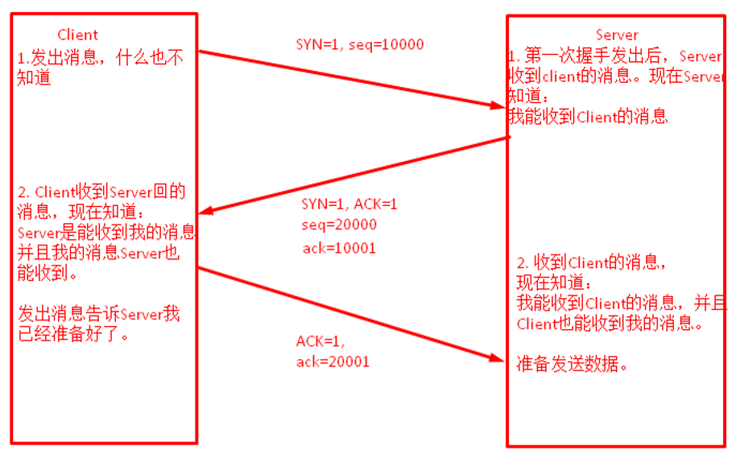

## 2.1 wireshark

- 先三次握手，再来TLS handshake。

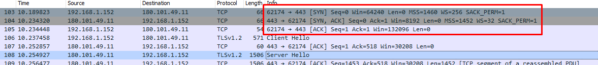

- 第一次握手

可以看到报文内容，比如第一次handshake，可用看到seq是0（relative number），ACK number 也是0，Flag是SYN。

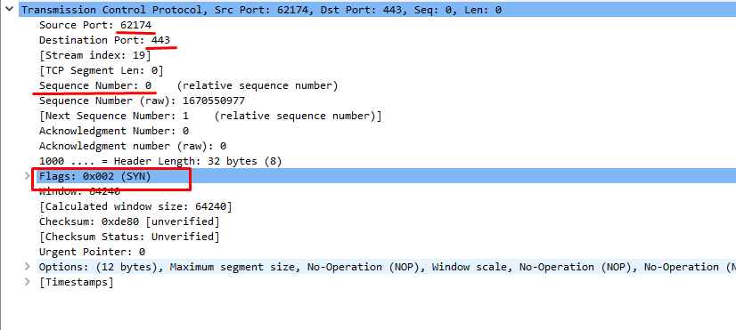

- 第二次握手

服务器返回，ACK = 1。Flag是SYN，ACK。

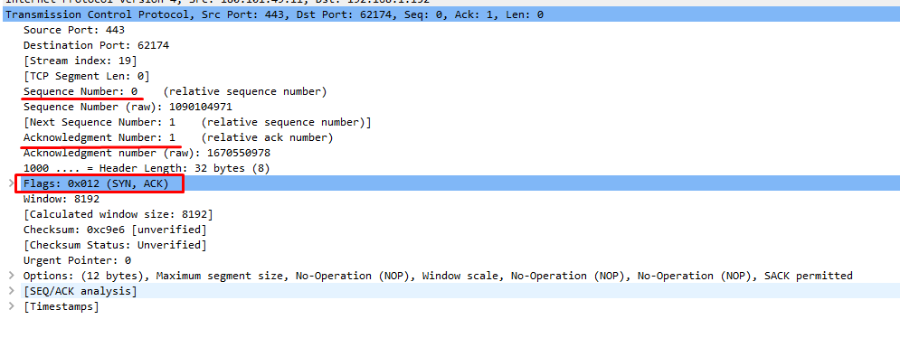

- 第三次握手

SYN = 1，ACK = 1。Flag 是 ACK。

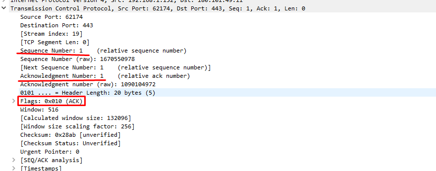

# 3、TLS Handshake

## 3.1 客户端发送Client Hello给服务器

首先，客户端（通常是服务器）先向服务器发出加密通信的请求，这个过程叫做Client Hello请求。

在这一步客户端主要提供了一下信息。

（1） 支持的协议版本，比如TLS 1.2版。
（2） 一个客户端生成的随机数，稍后用于生成"会话密钥"。
（3） 支持的加密方法，这里通常是一组加密套件（Cipher Suites）。
（4） 支持的压缩方法。

加密套件通常包含以下信息：

- 密钥交换算法

- 对称加密算法

- 摘要算法
  

| Cipher Suite                        | Key Exchange | Cipher       | Mac    |
| ----------------------------------- | ------------ | ------------ | ------ |
| TLS_RSA_WITH_3DES_EDE_CBC_SHA       | RSA          | 3DES_EDE_CBC | SHA    |
| TLS_DHE_RSA_WITH_AES_128_CBC_SHA256 | DHE_RSA      | AES_128_CBC  | SHA256 |

## 3.2 Wireshark--Client Hello

### TCP层

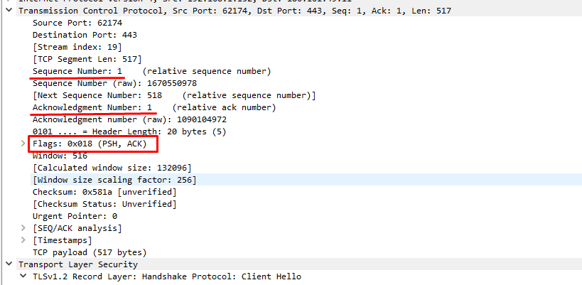

 

 

### TLS层

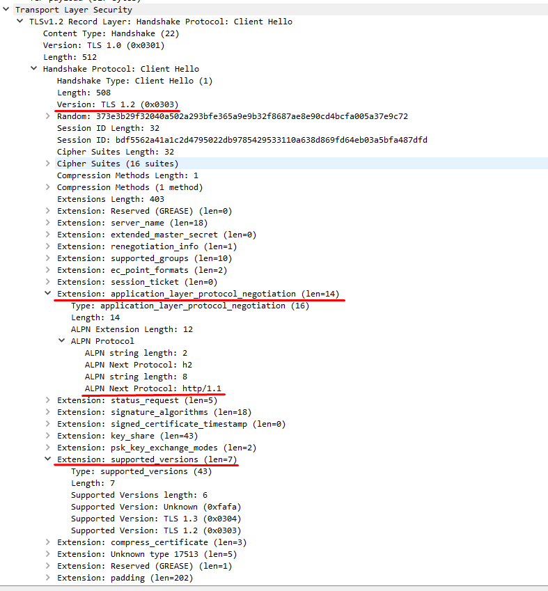

这里需要注意的是，客户端发送的信息之中不包括服务器的域名。也就是说，理论上服务器只能包含一个网站，否则会分不清应该向客户端提供哪一个网站的数字证书。这就是为什么通常一台服务器只能有一张数字证书的原因。

对于虚拟主机的用户来说，这当然很不方便。2006年，TLS协议加入了一个Server Name Indication扩展，允许客户端向服务器提供它所请求的域名。
 

 

 

## 3.3 服务器发送Server Hello给客户端

### 3.3.1 Server Hello

服务器收到客户端请求后，向客户端发出响应，这个过程叫做Server Hello。服务器响应包含以下内容。

（1） 确认使用的加密通信协议版本，比如TLS 1.2版本。如果浏览器与服务器支持的版本不一致，服务器关闭加密通信。

（2） 一个服务器生成的随机数，稍后用于生成"会话密钥"。

（3） 确认使用的加密方法，示例中返回的加密套件是 TLS_ECDHE_RSA_WITH_AES_128_GCM_SHA256，这个密码套件的意思是使用ECDHE_RSA算法进行密钥交换、使用AES_128算法进行对称加密、使用SHA256算法计算摘要。
 

### TCP 层

用的ACK返回。

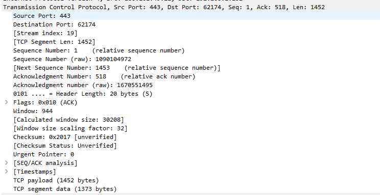

 

 

### TLS层

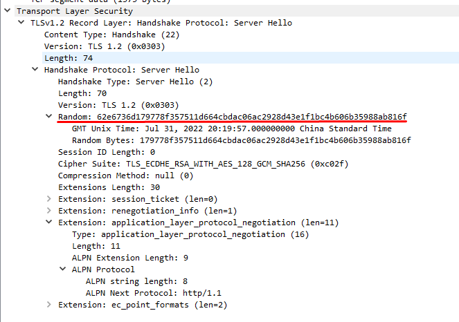

 

 

 

## 3.4 Certificate, Server Key Exchange, Server Hello Done

Server Certificate: 服务器发送自己的证书给客户端。

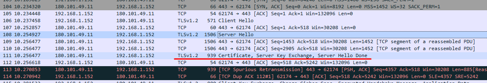

 

- Server Key Exchange

Server Key Exchange: 该消息是否发送取决于服务器选定的密钥交换算法，如果密钥交换算法是DHE_DSS、DHE_RSA或DH_anon时需要发送该消息。

The ServerKeyExchange message is sent by the server only when the server Certificate message (if sent) does not contain enough data to allow the client to exchange a premaster secret. This is true for the following key exchange methods:

DHE_DSS
DHE_RSA
DH_anon

 

- Certificate Request

除了上面这些信息，如果服务器需要确认客户端的身份，就会再包含一项请求，要求客户端提供"客户端证书"。比如，金融机构往往只允许认证客户连入自己的网络，就会向正式客户提供USB密钥，里面就包含了一张客户端证书。

 

 

- Server Hello Done: Server Hello消息发送结束。
  

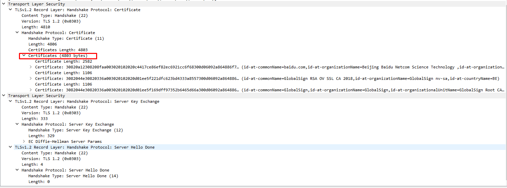

 

- TCP层

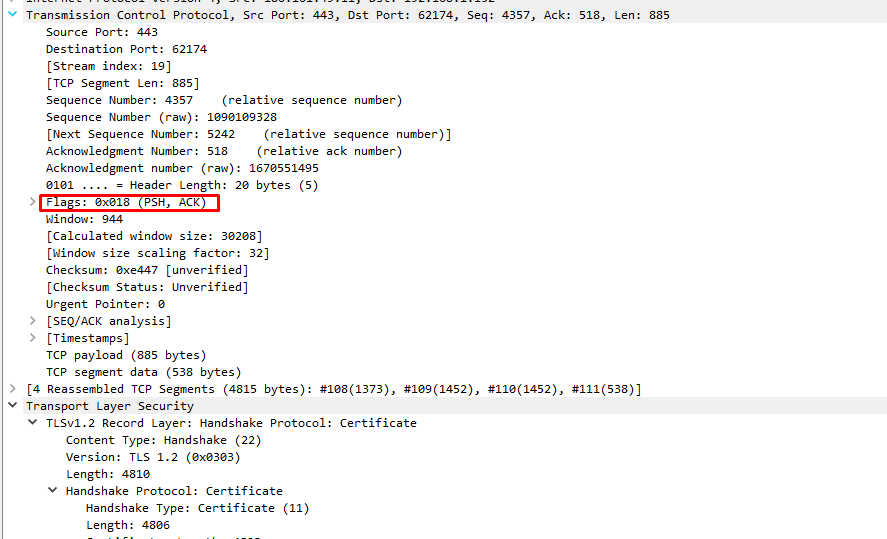

 

## 3.5 客户端响应Server Hello

客户端验证服务器证书。如果证书不是可信机构颁布、或者证书中的域名与实际域名不一致、或者证书已经过期，就会向访问者显示一个警告，由其选择是否还要继续通信。

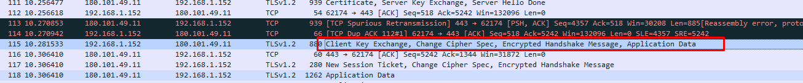

 

 

> Client Key Exchange, Change Cipher Spec, Encrypted Handshake Message, Application Data

 

 

- Client Certificate

客户端收到服务器响应后，如果服务器要求客户端上传证书，客户端发送自己的证书给服务器。

 

- Client Key Exchange

如果密钥交换算法是DHE_DSS、DHE_RSA或DH_anon，客户端发送自己的公钥给服务器。客户端和服务器各自依据DH参数生成 premaster secret 和 master secret。

由于抓包示例中使用的密钥交换算法是ECDHE_RSA，该密钥交换算法的过程如下图所示。想了解更多关于密钥交换算法的内容请参考: 

9. PKI - 三种密钥交换算法详解（RSA& DHE& ECDHE）及他们在SSL/TLS协议中的应用。

https://blog.csdn.net/ttyy1112/article/details/107770123

 

 

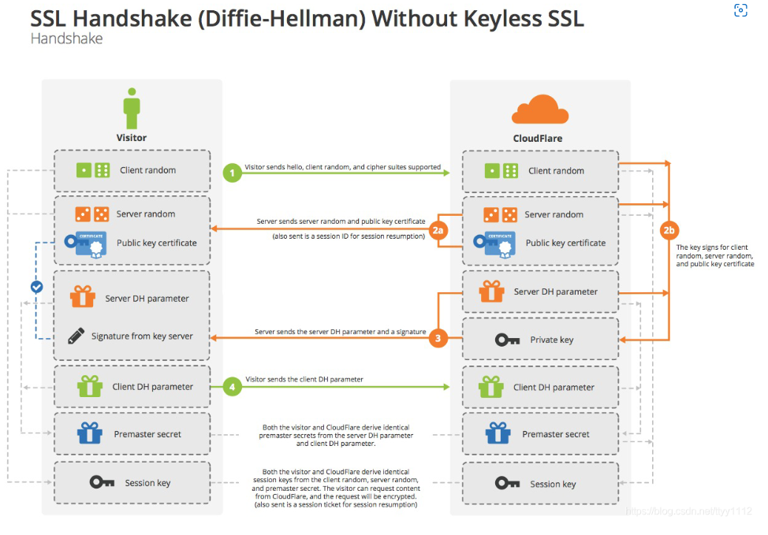

 

 

- Certificate Verify
  该消息仅在客户端发送Client Certificate消息时发送。客户端使用自己的私钥对先前的所有握手消息的哈希值进行签名，服务器使用客户端公钥对签名进行验证。如果签名验证通过，则客户端认证通过。

 

- Change Cipher Spec
  发送编码改变通知，表示随后的信息都将用双方商定的加密方法和密钥发送。

 

- Client Finished Message（Encrypted Handshake Message）
  客户端握手结束通知，表示客户端的握手阶段已经结束。这一项同时也是前面发送的所有内容的hash值，用来供服务器校验。

 

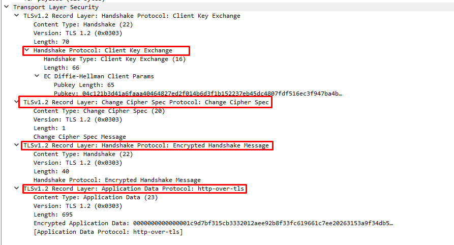

- TCP层

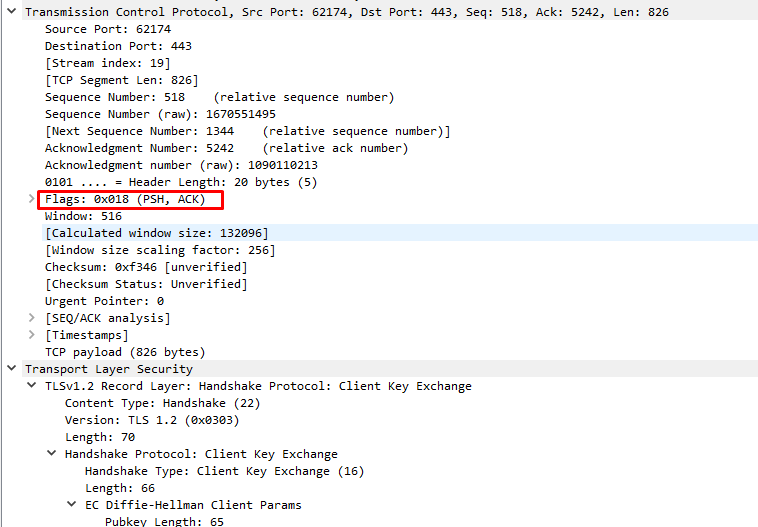

 

 

## 3.6 服务器的最后响应

### 3.6.1 Change Cipher Spec

编码改变通知，表示随后的信息都将用双方商定的加密方法和密钥发送。

 

 

### 3.6.2 Encrypted Handshake Message

Server Finished Hello = Encrypted Handshake Message

服务器握手结束通知，表示服务器的握手阶段已经结束。这一项同时也是前面发送的所有内容的hash值，用来供客户端校验。

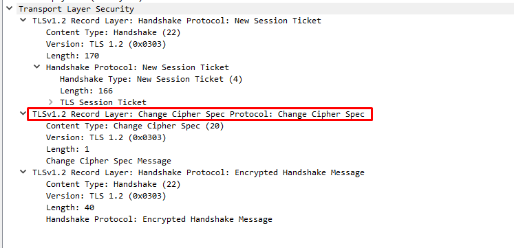

- TCP层

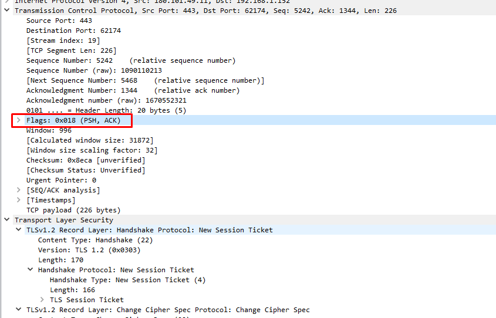

至此，整个握手阶段全部结束。接下来，客户端与服务器进入加密通信，就完全是使用普通的HTTP协议，只不过用"会话密钥"加密内容。

 

 

# 4、四次挥手

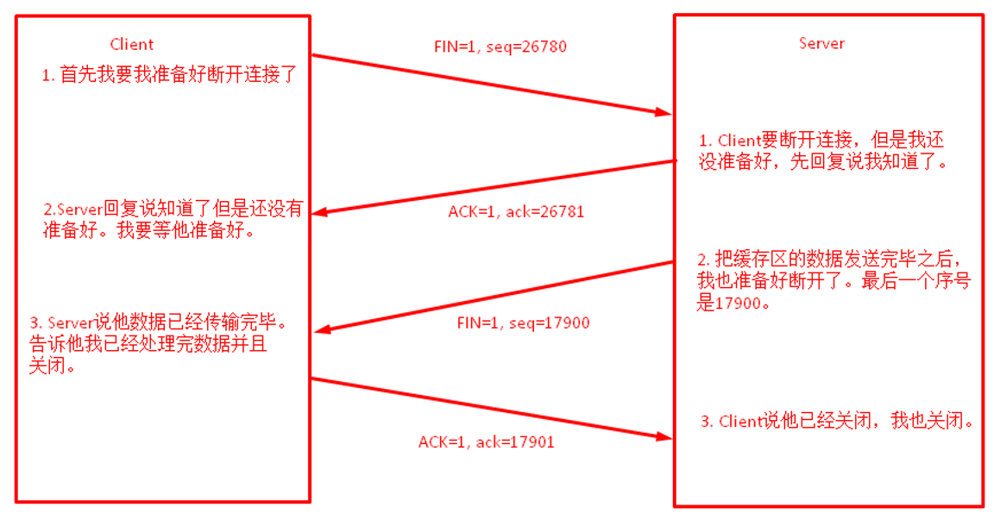

- 为什么要四次分手？

TCP协议是一种面向连接的、可靠的、基于字节流的运输层通信协议。TCP是全双工模式，这就意味着，当主机1发出FIN报文段时，只是表示主机1已经没有数据要发送了，主机1告诉主机2，它的数据已经全部发送完毕了；但是，这个时候主机1还是可以接受来自主机2的数据；当主机2返回ACK报文段时，表示它已经知道主机1没有数据发送了，但是主机2还是可以发送数据到主机1的；当主机2也发送了FIN报文段时，这个时候就表示主机2也没有数据要发送了，就会告诉主机1，我也没有数据要发送了，之后彼此就会愉快的中断这次TCP连接。

 

 

# 5、流量控制

https://blog.51cto.com/liangchaoxi/4052022

 

什么是window: 

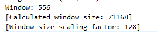

556*128 = 71168

在TCP三次握手过程中，可以通过SYN包开启TCP选项Window Size Scaling，设计出这个选项是因为如今的带宽已经大规模提升，千兆到桌面也是一件常事儿，因此，65535长度的窗口大小已经显得有些小了，为了突破这个限制，便有了Window Size Scaling选项。因此，上图中我们看到window size值是556，但是真正选用的值却是71168 (556*128)。

 

 

如果发送方把数据发送得过快，接收方可能会来不及接收，这就会造成数据的丢失。所谓流量控制就是让发送方的发送速率不要太快，要让接收方来得及接收。

利用`滑动窗口`机制可以很方便地在TCP连接上实现对发送方的流量控制。

设A向B发送数据。在连接建立时，B告诉了A：“我的接收窗口是 rwnd = 400 ”(这里的 rwnd 表示 receiver window) 。因此，发送方的发送窗口不能超过接收方给出的接收窗口的数值。请注意，TCP的窗口单位是字节，不是报文段。假设每一个报文段为100字节长，而数据报文段序号的初始值设为1。大写ACK表示首部中的确认位ACK，小写ack表示确认字段的值ack。

 

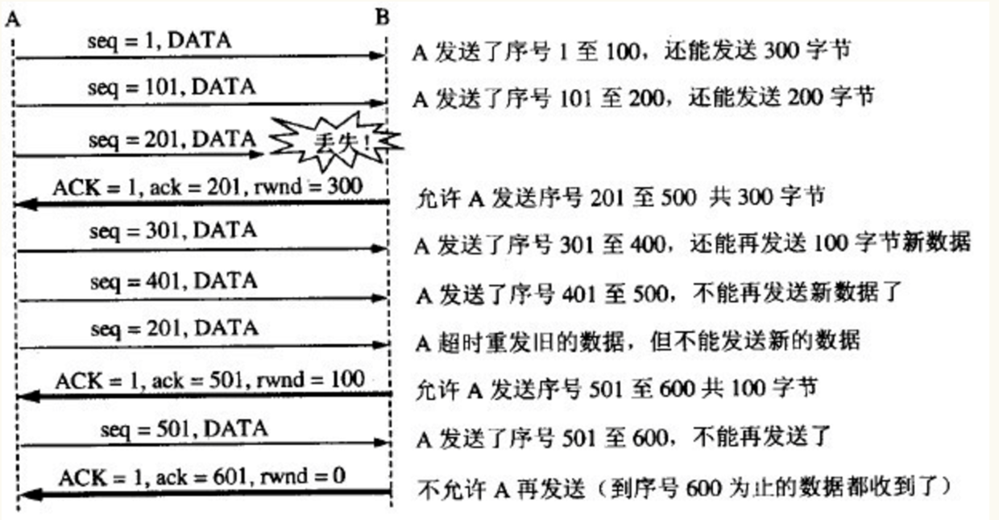

 

从图中可以看出，B进行了三次流量控制。第一次把窗口减少到 rwnd = 300 ，第二次又减到了 rwnd = 100 ，最后减到 rwnd = 0 ，即不允许发送方再发送数据了。这种使发送方暂停发送的状态将持续到主机B重新发出一个新的窗口值为止。B向A发送的三个报文段都设置了 ACK = 1 ，只有在ACK=1时确认号字段才有意义。

TCP为每一个连接设有一个持续计时器(persistence timer)。只要TCP连接的一方收到对方的零窗口通知，就启动持续计时器。若持续计时器设置的时间到期，就发送一个零窗口控测报文段（携1字节的数据），那么收到这个报文段的一方就重新设置持续计时器。

 

 

# 6、拥塞控制

 

## 6.1 慢开始和拥塞避免

发送方维持一个拥塞窗口 cwnd ( congestion window ) 的状态变量。拥塞窗口的大小取决于网络的拥塞程度，并且动态地在变化。发送方让自己的发送窗口等于拥塞窗口。

发送方控制拥塞窗口的原则是：只要网络没有出现拥塞，拥塞窗口就再增大一些，以便把更多的分组发送出去。但只要网络出现拥塞，拥塞窗口就减小一些，以减少注入到网络中的分组数。

 

 

### 慢开始算法：

当主机开始发送数据时，如果立即所大量数据字节注入到网络，那么就有可能引起网络拥塞，因为现在并不清楚网络的负荷情况。
因此，较好的方法是 先探测一下，即由小到大逐渐增大发送窗口，也就是说，由小到大逐渐增大拥塞窗口数值。

通常在刚刚开始发送报文段时，先把拥塞窗口 cwnd 设置为一个最大报文段MSS的数值。而在每收到一个对新的报文段的确认后，把拥塞窗口增加至多一个MSS的数值。用这样的方法逐步增大发送方的拥塞窗口 cwnd ，可以使分组注入到网络的速率更加合理。

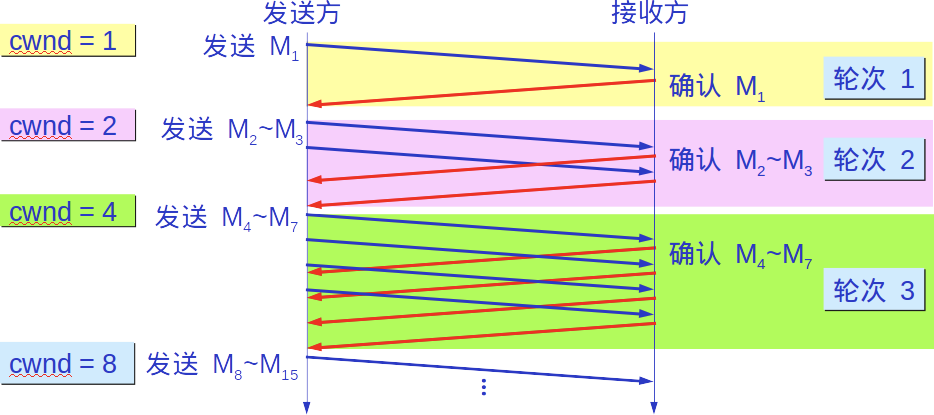

每经过一个传输轮次，拥塞窗口 cwnd 就加倍。一个传输轮次所经历的时间其实就是往返时间RTT。不过“传输轮次”更加强调：把拥塞窗口cwnd所允许发送的报文段都连续发送出去，并收到了对已发送的最后一个字节的确认。

另，慢开始的“慢”并不是指cwnd的增长速率慢，而是指在TCP开始发送报文段时先设置cwnd=1，使得发送方在开始时只发送一个报文段（目的是试探一下网络的拥塞情况），然后再逐渐增大cwnd。

为了防止拥塞窗口cwnd增长过大引起网络拥塞，还需要设置一个慢开始门限ssthresh状态变量。慢开始门限ssthresh的用法如下：

- 当 cwnd < ssthresh 时，使用上述的慢开始算法。
- 当 cwnd > ssthresh 时，停止使用慢开始算法而改用拥塞避免算法。
- 当 cwnd = ssthresh 时，既可使用慢开始算法，也可使用拥塞控制避免算法。

### 拥塞避免

让拥塞窗口cwnd缓慢地增大，即每经过一个往返时间RTT就把发送方的拥塞窗口cwnd加1，而不是加倍。这样拥塞窗口cwnd按线性规律缓慢增长，比慢开始算法的拥塞窗口增长速率缓慢得多。

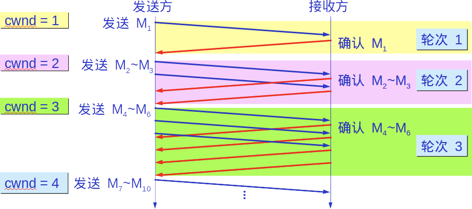

无论在慢开始阶段还是在拥塞避免阶段，只要发送方判断网络出现拥塞（其根据就是没有收到确认），就要把慢开始门限ssthresh设置为出现拥塞时的发送 方窗口值的一半（但不能小于2）。然后把拥塞窗口cwnd重新设置为1，执行慢开始算法。

这样做的目的就是要迅速减少主机发送到网络中的分组数，使得发生 拥塞的路由器有足够时间把队列中积压的分组处理完毕。

如下图，用具体数值说明了上述拥塞控制的过程。现在发送窗口的大小和拥塞窗口一样大。

 

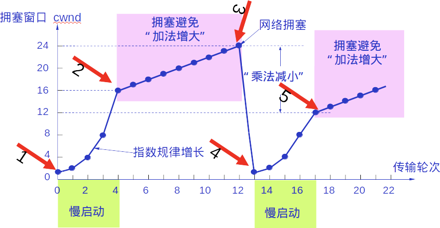

## 6.2 快重传和快恢复

### 快重传

快重传算法首先要求接收方每收到一个失序的报文段后就立即发出重复确认（为的是使发送方及早知道有报文段没有到达对方）而不要等到自己发送数据时才进行捎带确认。

 

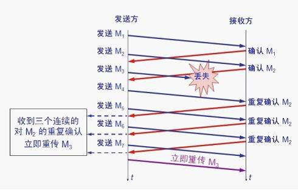

 

接收方收到了M1和M2后都分别发出了确认。现在假定接收方没有收到M3但接着收到了M4。

显然，接收方不能确认M4，因为M4是收到的失序报文段。根据 可靠传输原理，接收方可以什么都不做，也可以在适当时机发送一次对M2的确认。

但按照快重传算法的规定，接收方应及时发送对M2的重复确认，这样做可以让 发送方及早知道报文段M3没有到达接收方。发送方接着发送了M5和M6。接收方收到这两个报文后，也还要再次发出对M2的重复确认。这样，发送方共收到了 接收方的四个对M2的确认，其中后三个都是重复确认。

快重传算法还规定，发送方只要一连收到三个重复确认就应当立即重传对方尚未收到的报文段M3，而不必 继续等待M3设置的重传计时器到期。

由于发送方尽早重传未被确认的报文段，因此采用快重传后可以使整个网络吞吐量提高约20%。

### 快恢复

与快重传配合使用的还有快恢复算法，其过程有以下两个要点：

- 当发送方连续收到三个重复确认，就执行“乘法减小”算法，把慢开始门限ssthresh减半。
- 与慢开始不同之处是现在不执行慢开始算法（即拥塞窗口cwnd现在不设置为1），而是把cwnd值设置为 慢开始门限ssthresh减半后的数值，然后开始执行拥塞避免算法（“加法增大”），使拥塞窗口缓慢地线性增大。

 

 

# 7、TCP的常见误区

误区1：TCP协议三次握手过程中后两个包都是[ACK]包。

解释:这种说法并不错，只是不严谨。首先，第一个包是[SYN]，SYN位在TCP报头flag字段中，见上图TCP报头结构。第二个包更确切地说应该叫[SYN,ACK]包，因为除了ACK位被置位以外，SYN位也被置位了。第三个包才是单纯的ACK包，因为只有ACK位被置位。所以三次握手的过程为:

客户端----[SYN]------------------>>>服务器

客户端<<<-------------[SYN,ACK]---服务器

客户端----[ACK]------------------>>>服务器

有一种非常经典的攻击叫SYN Flood攻击，是DDOS攻击的一种，方法是客户端发送多个SYN包请求但是不回复第三个ACK包以占用服务器有限的资源。

 

误区2：TCP数据传输过程中，序列号增长的单元是包的个数。

解释：这是初学者最常犯的一个错误，原因是绝大多数老师为了方便学生理解，刚开始举例子时序列号都是+1地往上增。其实不然。序列号增长的单元是包应用层数据(也叫Payload)的字节数。

举个栗子：

假如某一个数据包序列号：1000，Payload长度500。那么下一个包的序列号就是1500。

 

误区3：对于TCP连接的双方，序列号都会增长。

解释：对于多数应用(HTTP，Telnet)，双方都存在数据的发送，那么双方的序列号都会增长，而对于FTP这样的应用，在数据通道中，只是某一方在传输数据(上传或下载)，那么另一方只是在扮演简单确认的角色，在这种情况下，另一方的序列号并不会增长。

 

 

# 8、为什么HTTP3.0要弃用TCP协议，而改用UDP协议？

https://blog.51cto.com/u_6315133/3122045

建立连接时间长(本质上是TCP的问题)

移动互联网领域表现不佳(弱网环境)

- 队头阻塞问题 （Head-of-Line blocking）

如果HTTP/2连接双方的网络中有一个数据包丢失，或者任何一方的网络出现中断，整个TCP连接就会暂停，丢失的数据包需要被重新传输。因为TCP是一个按序传输的链条，因此如果其中一个点丢失了，链路上之后的内容就都需要等待。

这种单个数据包造成的阻塞，就是TCP上的队头阻塞（head of line blocking）。

